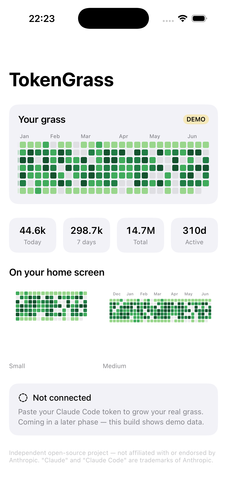
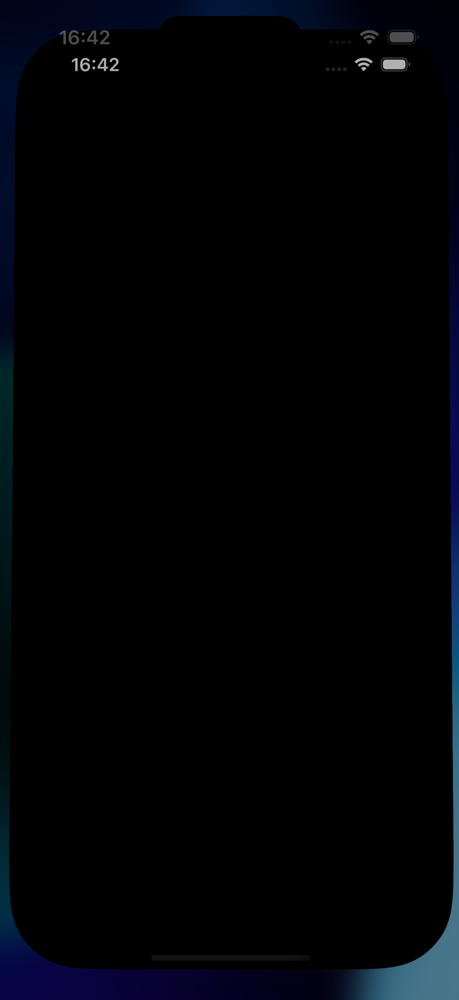

# TokenGrass 🌱

> Your Claude usage as a GitHub-style contribution graph — on your iPhone home-screen widget. Free, open source.

<p align="center">
  
  &nbsp;&nbsp;
  
</p>

<p align="center"><sub>Demo data shown — running on the iOS 26 simulator.</sub></p>

TokenGrass turns your daily Claude usage into a familiar contribution heatmap and
puts it **directly on your home screen as a widget** — glance, don't tap. No paywall.

**Status:** working prototype. A macOS menu-bar companion reads your usage and
renders the grass live; iCloud sync to the iPhone widget is code-complete and turns
on with a paid Apple Developer account. See [`docs/ARCHITECTURE.md`](docs/ARCHITECTURE.md).

## How it works

Anthropic doesn't let third-party apps log in as you or read your subscription
usage from the phone, so the data is collected on your Mac (where you're already
signed into Claude Code) and synced to the phone — the same shape as the validated
"Usage for Claude", plus the home-screen **grass widget** it lacks.

```
[Mac companion]  reads Claude Code's keychain token → polls /api/oauth/usage
      │          → accumulates daily usage intensity → renders grass
      ▼  iCloud (key-value, a few KB)
[iPhone app]  mirrors into the App Group → [Widget] renders the grass
```

- **No backend, no server, no accounts.** Apple's iCloud does the sync; the token
  never leaves your Mac's Keychain.
- The grass fills **forward** from when you install it (Anthropic exposes current
  rate-limit utilization, not a backfillable daily history).

**Requires** Claude Code installed and logged in on the Mac (the data source).

## Project layout

```
token-grass/
├─ TokenGrassCore/      # Pure logic (Foundation-only) — models, grass math, accumulator, OAuth/usage parsing. Unit-tested.
│  └─ TokenGrassPoll/   #   dev CLI: validate keychain → usage → accumulate headlessly
├─ SharedUI/            # SwiftUI grass views (cross-platform) + iCloud store
├─ TokenGrass/          # iOS app target (display + iCloud pull)
├─ TokenGrassWidget/    # iOS widget extension (WidgetKit)
├─ TokenGrassMac/       # macOS menu-bar companion (the data engine)
├─ docs/                # DESIGN / ROADMAP / APPSTORE / ARCHITECTURE
└─ project.yml          # XcodeGen project definition (source of truth)
```

Design choice: all grass math lives in `TokenGrassCore`, a plain Swift package with
**no SwiftUI/WidgetKit imports**, so it compiles and unit-tests without Xcode.

## Build

Requires Xcode 17+ and [XcodeGen](https://github.com/yonaskolb/XcodeGen).

```bash
brew install xcodegen        # once
xcodegen generate            # creates TokenGrass.xcodeproj from project.yml
open TokenGrass.xcodeproj     # set your signing team, then run TokenGrassMac / TokenGrass
```

| Target | Bundle ID | Distribution |
|---|---|---|
| iOS app | `dev.yulebuilds.tokengrass` | App Store |
| iOS widget | `dev.yulebuilds.tokengrass.widget` | (with the app) |
| macOS companion | `dev.yulebuilds.tokengrass.mac` | Direct download (notarized) |

App Group `group.dev.yulebuilds.tokengrass` · min iOS 17 / macOS 14. iCloud sync and
App Store / TestFlight distribution require the paid Apple Developer Program.

## Test

The core logic is verified headlessly (no Xcode project needed):

```bash
cd TokenGrassCore && swift test
```

## Disclaimer

TokenGrass is an independent, open-source project and is not affiliated with,
endorsed by, or sponsored by Anthropic. "Claude" and "Claude Code" are trademarks
of Anthropic. It uses unofficial endpoints and your existing Claude Code login, and
may stop working if Anthropic changes them.

## License

[MIT](LICENSE)
